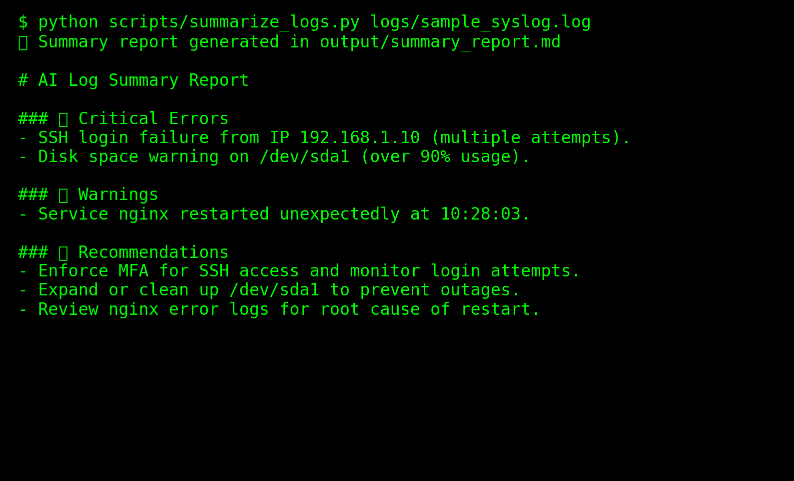

# 🤖 AI-Powered Workflows

This section focuses on building GPT-powered assistants and AI-driven workflows for IT and compliance.

## 📂 Project

- **[AI Log Summarizer](.)**  
  Workflow that ingests raw logs, summarizes critical issues, and generates compliance-ready reports.

---

## 🖥️ Demo Screenshot




Running the script on `sample_syslog.log`:

```bash
$ python scripts/summarize_logs.py logs/sample_syslog.log
✅ Summary report generated in output/summary_report.md
```

### Example Generated Report

```markdown
# AI Log Summary Report

### 🔴 Critical Errors
- SSH login failure from IP `192.168.1.10` (multiple attempts).
- Disk space warning on `/dev/sda1` (over 90% usage).

### 🟠 Warnings
- Service `nginx` restarted unexpectedly at 10:28:03.

### 🟢 Recommendations
- Enforce MFA for SSH access and monitor login attempts.
- Expand or clean up `/dev/sda1` to prevent outages.
- Review nginx error logs for root cause of restart.
```

---

📌 **Skills:** GPT-4/5, Prompt Engineering, Compliance Automation, AI Workflows
