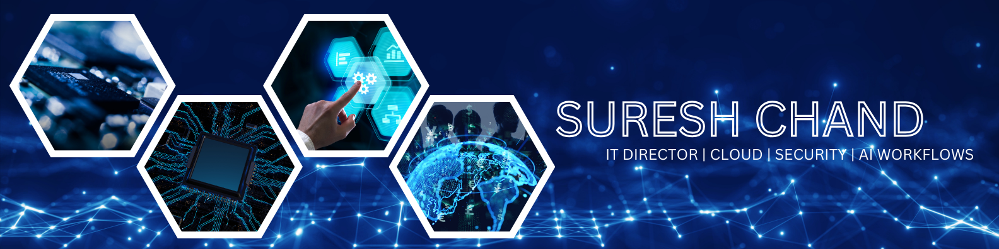

# 🚀 Suresh Chand – Project Portfolio

This repository is my portfolio hub, showcasing projects across **Cloud Infrastructure, Security & Compliance, Automation Scripts, and AI-Powered Workflows**.  
Each section has its own folder with documentation, scripts, and case studies.

---

## ⭐ Featured Projects
- [PCI DSS 4.0.1 Certification Automation →](https://github.com/suresh-1001/pci-dss-certification-automation)
- [Automated On/Offboarding →](https://github.com/suresh-1001/hr-onboarding-automation)
- [Jira Service Automation →](https://github.com/suresh-1001/jira-service-automation)
- [Fintech Alignment (Case Study) →](https://github.com/suresh-1001/fintech-alignment-project)

---

## ⚙️ Tools (Scripts & Automation)
Cross-platform troubleshooting and self-healing scripts.

- ** macOS Secure Management** – CIS / PCI-aligned hardening baseline, Intune MDM setup, and secure-mac.sh automation script.  
  🔗 Repo: [macOS Secure Management →](https://github.com/suresh-1001/suresh-1001/tree/main/Tools/macos-secure-management)  
  🔗 Related: [Security-Compliance Blueprints →](https://github.com/suresh-1001/secure-infra-blueprints)

- **🪟 Windows Auto-Debug** – PowerShell toolkit to collect logs, system health, and quick fixes.  
  🔗 Repo: [Windows Auto-Debug →](https://github.com/suresh-1001/tools-monorepo/tree/main/windows-auto-debug)

- **🐧 Linux Auto-Debug** – Bash toolkit for Ubuntu/AlmaLinux health checks and remediation.  
  🔗 Repo: [Linux Auto-Debug →](https://github.com/suresh-1001/tools-monorepo/tree/main/linux-auto-debug)

- **🛡️ Linux Secure Check & Hardening** – Automated CIS audit & hardening for Ubuntu/AlmaLinux.  
  🔗 Repo: [Linux Secure Check & Hardening →](https://github.com/suresh-1001/tools-monorepo/tree/main/linux-secure-check)

- **☁️ M365 / Ops Scripts** – License audits, Conditional Access, Intune automation, and backups.  
  🔗 Repo: [M365 / Ops Scripts →](https://github.com/suresh-1001/tools-monorepo/tree/main/m365-scripts)

---

## 📂 Director’s IT Handbook
Leadership-focused templates and automation playbooks for IT operations.

- [IT Ops Control Center →](https://github.com/suresh-1001/it-ops-control-center)
- [Incident Response →](https://github.com/suresh-1001/it-director-handbook/tree/main/Incident-Response)
- [Budgeting & Finance →](https://github.com/suresh-1001/it-director-handbook/tree/main/Budgeting)
- [Roadmaps & KPIs →](https://github.com/suresh-1001/it-director-handbook/tree/main/Roadmaps)
- [Team Management & Career Growth →](https://github.com/suresh-1001/it-director-handbook/tree/main/Team-Management)
- [Vendor RFPs & Scorecards →](https://github.com/suresh-1001/it-director-handbook/tree/main/RFPs)

---

## ☁️ Secure Infrastructure Blueprints
Deployments and automation for Azure, AWS, and OCI environments.

- [WordPress + MariaDB →](https://github.com/suresh-1001/secure-infra-blueprints/tree/main/Examples/WordPress-Docker)
- [Kubernetes Cluster Deployment →](https://github.com/suresh-1001/secure-infra-blueprints/tree/main/Kubernetes-Cluster)

---

## 🌐 OCI API Gateway Demo
Public SSL gateway in front of a private backend (Terraform + OCI CLI).  
🔗 [OCI API Gateway Demo →](https://github.com/suresh-1001/secure-infra-blueprints/tree/main/OCI-API-Gateway)

---

## 📊 IT Operations Dashboards
Grafana dashboards & Prometheus configurations for operational visibility.  
🔗 [IT Operations Dashboards →](https://github.com/suresh-1001/it-ops-dashboards)

---

## 🔒 Security & Compliance
- [IT Audit Toolkit →](https://github.com/suresh-1001/it-audit-toolkit)
- [PCI DSS 4.0.1 Certification Automation →](https://github.com/suresh-1001/pci-dss-certification-automation)
- [Fintech Alignment (Case Study) →](https://github.com/suresh-1001/fintech-alignment-project)

---

## 🧠 AI-Powered Workflows
- [AI Log Summarizer →](https://github.com/suresh-1001/suresh-1001/tree/main/AI-Automation/ai-log-summarizer)
- [Automated On/Offboarding (Workspace/Intune/Slack) →](https://github.com/suresh-1001/hr-onboarding-automation)
- [Jira Service Automation →](https://github.com/suresh-1001/jira-service-automation)

---

## 📫 Connect
- 📧 Email: [suresh@echand.com](mailto:suresh@echand.com)  
- 💼 LinkedIn: [linkedin.com/in/sureshchand01 →](https://www.linkedin.com/in/sureshchand01)

---

⭐ Explore each section for detailed **case studies, code samples, and documentation**.

