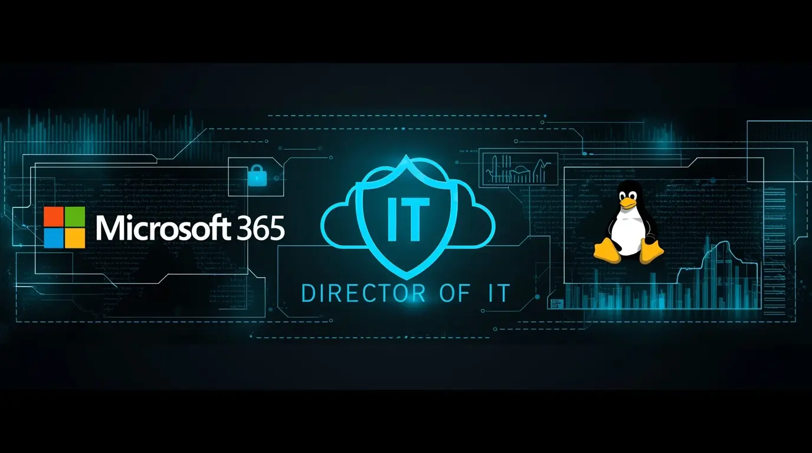

# Hi, I'm Suresh Chand 👋

**Director of IT** · San Jose, CA  
20+ years building, securing, and operating enterprise infrastructure — from fintech to SaaS to enterprise.

I'm hands-on across the full stack: identity, endpoints, Linux infrastructure, containers, monitoring, compliance, and automation. I don't just manage IT — I build it.

📄 [View my case studies](https://github.com/suresh-1001/case-studies) · 💼 [LinkedIn](https://linkedin.com/in/sureshchand01) · 🌐 [Linesight Digital](https://linesightdigital.com)

---

## 🔑 What I Work On

| Area | Tools & Technologies |
|------|----------------------|
| **Identity & Access** | Microsoft Entra ID · Conditional Access · MFA · Intune · Active Directory |
| **Security & Compliance** | PCI DSS 4.0.1 · CIS Benchmarks · Kali Linux · Wazuh · Defender for Endpoint |
| **Linux Infrastructure** | Ubuntu 22.04/24.04 · Fedora CoreOS · Docker · Podman · NGINX · FreeRADIUS |
| **Monitoring & Observability** | Prometheus · Grafana · Alertmanager · Wazuh · Elasticsearch |
| **Automation & Scripting** | PowerShell · Python · Microsoft Graph SDK · Butane/Ignition · systemd |
| **Email Security** | DKIM · DMARC · SPF · OME · Exchange Online |
| **Cloud & Networking** | Azure · OCI · Cloudflare · Hyper-V · VMware · Technitium DNS |

---

## 🏆 Career Highlights

- ✅ Led **PCI DSS 4.0.1 certification** end-to-end — gap analysis through audit completion — at a fintech company
- ✅ Built **automated evidence pipeline** cutting audit prep time by ~60%
- ✅ Designed **Entra ID Conditional Access** architecture balancing security and usability at scale
- ✅ Resolved a **company-wide email outage** caused by sensitivity label encryption misconfiguration
- ✅ Deployed **Prometheus + Grafana + Alertmanager** stack with Telegram alerting for real-time ops visibility
- ✅ Built **Fedora CoreOS + Podman** infrastructure using Butane → Ignition automated provisioning
- ✅ Implemented **1-click on/offboarding** via PowerShell + Intune + Slack reducing provisioning from hours to minutes

---

## 📂 Featured Repos

| Repo | What It Does |
|------|--------------|
| [case-studies](https://github.com/suresh-1001/case-studies) | Real-world IT wins — PCI DSS automation, on/offboarding, SOC visibility |
| [pci-dss-certification-automation](https://github.com/suresh-1001/pci-dss-certification-automation) | PowerShell/Python evidence collectors for PCI DSS 4.0.1 |
| [pci-dss-evidence-assistant](https://github.com/suresh-1001/pci-dss-evidence-assistant) | AI-powered PCI DSS documentation workflow |
| [linux-server-onboarding-baseline](https://github.com/suresh-1001/linux-server-onboarding-baseline) | Bash script to harden and baseline fresh Linux servers |
| [email-authentication-audit-toolkit](https://github.com/suresh-1001/email-authentication-audit-toolkit) | SPF, DKIM, DMARC audit + DNS validation scripts |
| [Enterprise-Infrastructure-Architecture](https://github.com/suresh-1001/Enterprise-Infrastructure-Architecture) | On-prem infrastructure playbooks — AD, Veeam, Puppet, DR |
| [m365-intune-device-management-baseline](https://github.com/suresh-1001/m365-intune-device-management-baseline) | Intune device hardening and compliance baseline |
| [it-ops-control-center](https://github.com/suresh-1001/it-ops-control-center) | FastAPI + Prometheus/Grafana unified IT ops dashboard |

---

## 🧰 Current Stack

**Microsoft:** M365 · Entra ID · Intune · Exchange Online · SharePoint · Defender · PowerShell  
**Linux:** Ubuntu · Fedora CoreOS · Docker · Podman · NGINX Proxy Manager · Portainer  
**Monitoring:** Prometheus · Grafana · Alertmanager · Wazuh · Node Exporter  
**Compliance:** PCI DSS 4.0.1 · CIS Benchmarks · DKIM/DMARC/SPF  
**Cloud:** Azure · OCI · Cloudflare
**Virtualization** VMware ESXi · Hyper-V · Proxmox · vSphere

---

## 💼 Open To

- **Director of IT / Cloud Infrastructure / DevSecOps roles** — remote or hybrid, Bay Area preferred
- **Upwork consulting** — Microsoft 365, Linux infrastructure, PCI DSS compliance, security hardening

📬 suresh@echand.com · [linkedin.com/in/sureshchand01](https://linkedin.com/in/sureshchand01)
