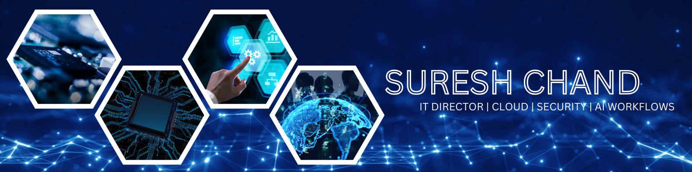

---

## 🟢 Available for Consulting Engagements & Contract Roles — [Book a Call](mailto:suresh@echand.com)

---

## Enterprise IT Infrastructure & Security Engineer

Specializing in Cloud Automation, Compliance Engineering, and Systems Reliability.

---

## 💡 Impact Snapshot

- 💠 **Led enterprise PCI DSS 4.0.1 certification** — reduced audit evidence preparation time by 60%
- ☁️ **Deployed Azure / AWS / OCI automation stacks** — improved provisioning speed by 45%
- 🧠 **Integrated AI tools** (ChatGPT, Claude, Gemini) for audit documentation & log summarization

---

## 🔐 Security & Compliance

> PCI DSS 4.0.1 · SOC 2 · NIST · CMMC · M365 · Linux Hardening

| Project | Description |
|---|---|
| 🛡 [PCI DSS 4.0.1 Certification Automation](https://github.com/suresh-1001/pci-dss-certification-automation) | End-to-end automation for PCI DSS evidence collection & audit prep |
| 🤖 [PCI DSS Evidence Assistant (AI-Powered)](https://github.com/suresh-1001/pci-dss-evidence-assistant) | AI-driven documentation workflow — prompts, templates & tracker |
| 🏢 [M365 Compliance Showcase](https://github.com/suresh-1001/m365-compliance-showcase) | Read-only M365 evidence exports & posture checks (NIST/CMMC) |
| 🐧 [Linux Secure Check & Hardening](https://github.com/suresh-1001/tools-monorepo/tree/main/linux-secure-check) | Automated Linux baseline hardening scripts |

---

## ☁️ Infrastructure & Automation

> Azure · AWS · OCI · Terraform · Kubernetes · Puppet · VMware · Veeam

| Project | Description |
|---|---|
| 🔧 [Lab PC Infrastructure Migration & Azure Integration](https://github.com/suresh-1001/Lab-PC-Infrastructure-Migration-Azure-Integration-Blueprint) | Enterprise migration blueprint with Azure integration |
| 🪟 [Secure Windows Baseline Framework](https://github.com/suresh-1001/Secure-Windows-Baseline-Framework) | PowerShell-based Windows hardening & baseline enforcement |
| 🐳 [WordPress + MariaDB (Docker)](https://github.com/suresh-1001/secure-infra-blueprints/tree/main/Examples/WordPress-Docker) | Containerised deployment with secure config |
| ☸️ [Kubernetes Cluster Deployment](https://github.com/suresh-1001/secure-infra-blueprints/tree/main/Kubernetes-Cluster) | Production-grade K8s cluster setup |
| 🔗 [OCI API Gateway Demo](https://github.com/suresh-1001/secure-infra-blueprints/tree/main/OCI-API-Gateway) | Public SSL gateway in front of a private backend (Terraform + OCI CLI) |
| 📊 [IT Ops Control Center](https://github.com/suresh-1001/it-ops-control-center) | FastAPI + Prometheus/Grafana unified ops dashboard (SOC 2 friendly) |

---

## 📁 Case Studies

Real-world engagements — problem, approach, and measurable outcome.

| # | Case Study | Focus Area |
|---|---|---|
| 001 | [PCI DSS Evidence Automation](https://github.com/suresh-1001/case-studies/tree/main/001-pci-evidence-automation) | Compliance · Audit Automation |
| 002 | [On/Offboarding 1-Click](https://github.com/suresh-1001/case-studies/tree/main/002-onoffboarding-1click) | IT Ops · Identity Management |
| 003 | [SOC Visibility (Wazuh + Prometheus)](https://github.com/suresh-1001/case-studies/tree/main/003-soc-visibility) | Security Operations · Monitoring |

---

## 🛠 Tech Stack

**Cloud & Infra:** Azure · AWS · OCI · VMware · Veeam · Puppet · Kubernetes · Terraform  
**Security & Compliance:** PCI DSS 4.0.1 · SOC 2 · NIST · CMMC · Active Directory · Wazuh  
**Scripting & Automation:** PowerShell · Python · Bash · FastAPI  
**Monitoring:** Prometheus · Grafana  
**AI Tools:** ChatGPT · Claude · Gemini (audit docs, log summarisation, evidence workflows)

---

## 📬 Work With Me

I work with organisations on infrastructure architecture, compliance automation, and security engineering — both as a consultant and on contract.

- **Consulting:** Architecture reviews, PCI/SOC compliance programs, cloud migrations
- **Freelance:** Automation scripts, hardening frameworks, monitoring stacks
- **Contract:** Director/Head of IT, Infrastructure Lead roles

📧 [suresh@echand.com](mailto:suresh@echand.com) &nbsp;|&nbsp; 💼 [LinkedIn](https://linkedin.com/in/sureshchand01)
